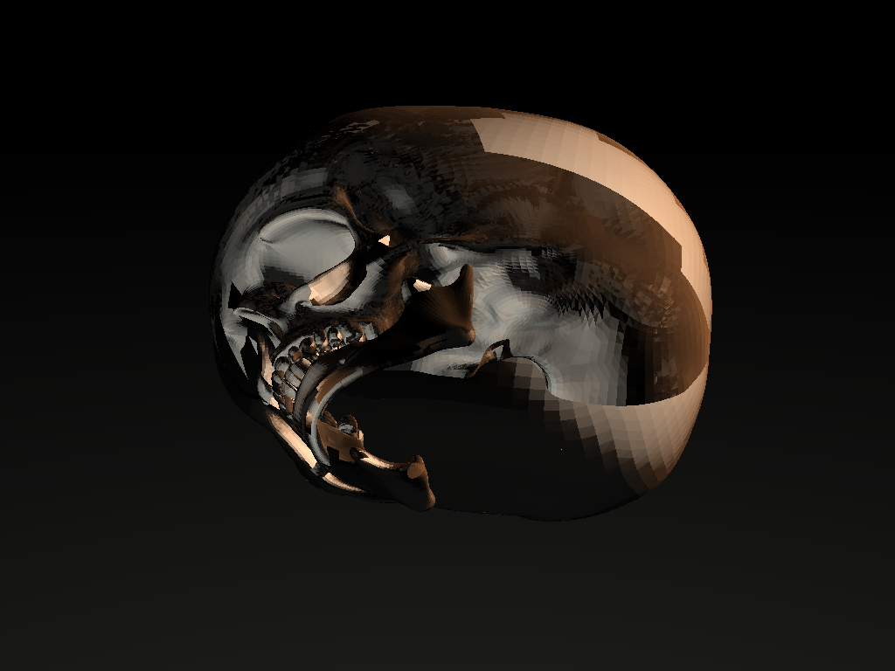

# Ray Tracer
### An extensible ray tracer made with .NET

Overview

This repository contains a small, extensible ray tracer written in C# targeting .NET 10. It started as a university project and has been modernized to include a core rendering library, unit tests, and a command-line interface for rendering scenes.

Projects

- RayTracer.Core — core ray tracing library: primitives (Sphere, Plane, Triangle, Box, Cylinder, Disk), materials, scenes, and the rendering engine.
- Raytracer.Cli — console app to render scenes from the command line.
- RayTracer.Core.Tests — unit tests for primitives and basic rendering features (MSTest).

Top-level structure

- RayTracer.sln — Visual Studio/.NET solution file
- RayTracer.Core/ — main library and scene definitions
- Raytracer.Cli/ — CLI that exposes scenes and rendering options
- RayTracer.Core.Tests/ — MSTest unit tests
- assets/ — example textures and produced renders used in the README

Available scenes (CLI)

- sphere — simple sphere scene
- triangle — ground plane + triangle
- box — axis-aligned box scene
- cylinder — finite cylinder scene
- disk — circular disk scene
- billiards — billiards table with multiple colored balls (shown above)
- crystal-orchard — decorative crystalline Orchard (larger scene)

Developer quickstart (local)

Prerequisites
- .NET 10 SDK (tested with /usr/local/share/dotnet/dotnet 10.0.x)
- Optional: GitHub CLI (`gh`) if you want to open PRs from the command line

Build and run
1. Clone the repository and change into it:
   - git clone https://github.com/adamstirtan/raytracer.git
   - cd raytracer
2. Restore and build:
   - dotnet restore
   - dotnet build -c Release
3. Run tests:
   - dotnet test -c Release
4. Render a scene with the CLI (example):
   - dotnet run --project Raytracer.Cli/Raytracer.Cli.csproj -c Release -- --scene billiards --width 1024 --height 768 --out ./billiards.png

Notes about the runtime and testing
- Tests use MSTest in RayTracer.Core.Tests and exercise primitive intersection logic and small scene renders. Running `dotnet test` will run the unit suite.
- If you see compiler errors referencing ambiguous types (e.g., Plane vs System.Numerics.Plane or Math vs RayTracer.Core.Math), fully-qualify the type (e.g., `RayTracer.Core.Primitives.Plane` or `System.Math.PI`) or add a using alias to disambiguate.

Coding conventions & tips
- Prefer `System.Math` or `MathF` for math constants and functions to avoid collisions with the `RayTracer.Core.Math` namespace.
- Use `System.Numerics.Vector3` for vectors; the project already uses these types across primitives and math utilities.
- Keep scene construction in the Scenes folder (RayTracer.Core/Scenes) and make small, reviewable changes to avoid large render regressions.

Adding scenes & assets
- Add a new Scene class under RayTracer.Core/Scenes/ and register objects using AddObject/AddLight in the scene constructor.
- Add any textures to `RayTracer.Core/Textures` (the csproj copies a few textures to output by default).

CLI notes
- The CLI accepts a `--scene` argument that names a scene; check Raytracer.Cli/Program.cs for CLI options and add flags there for additional rendering controls (antialiasing, samples, threads).

CI & automation suggestions
- Add a GitHub Actions workflow that runs `dotnet restore`, `dotnet build`, and `dotnet test` on PRs.
- Optionally add a workflow to produce sample renders as artifacts for PR previews (run the CLI on a small scene at low resolution).

Common troubleshooting
- Build errors about ambiguous types: qualify the type with the namespace or add an alias.
- Tests failing due to numeric tolerances: some tests validate intersection distances — small floating-point variations between runtimes may require relaxed assertions.

Contributing
- Fork or branch, implement changes, run `dotnet test` locally, open a PR with clear description and small commits.
- For larger changes (mesh loader, BVH acceleration), open an RFC issue describing design, benchmarks, and an incremental plan.

If you want, I can:
- Add a GitHub Actions workflow that runs the build and tests on PRs (I can open a PR with the workflow). 
- Add a small CONTRIBUTING.md with typical developer steps and code style rules.
- Add a script to produce sample renders (batch) and save artifacts to `assets/renders/` for PR previews.

— Dex
