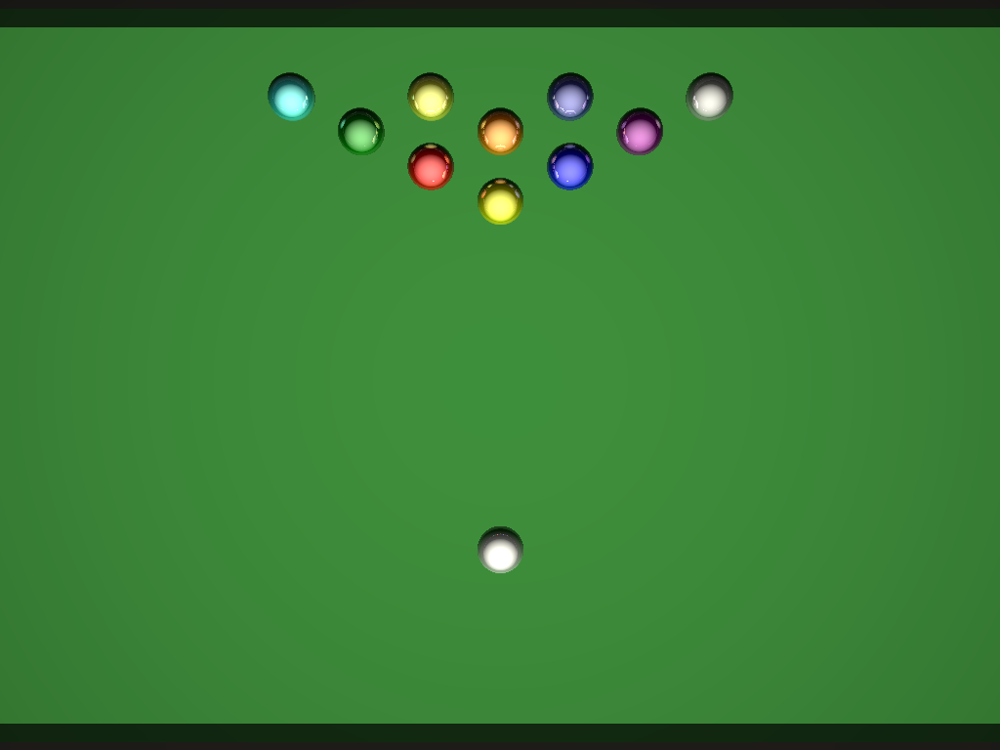

# Ray Tracer
### An extensible ray tracer made with .NET
***

Overview

This repository contains a small, extensible ray tracer written in C# targeting .NET 10. It started as a university project and has been modernized to include a core rendering library, unit tests, and a command-line interface for rendering scenes.

Projects

- RayTracer.Core — core ray tracing library: primitives (Sphere, Plane, Triangle, Box, Cylinder, Disk), materials, scenes, and the rendering engine.
- Raytracer.Cli — console app to render scenes from the command line.
- RayTracer.Core.Tests — unit tests for primitives and basic rendering features (MSTest).

Available scenes (CLI)

- sphere — simple sphere scene
- triangle — ground plane + triangle
- box — axis-aligned box scene
- cylinder — finite cylinder scene
- disk — circular disk scene
- billiards — billiards table with multiple colored balls (shown above)

Build & run (quickstart)

1. Install .NET 10 SDK.
2. Restore and build:
   - dotnet restore
   - dotnet build -c Release
3. Render a scene with the CLI, for example:
   - dotnet run --project Raytracer.Cli/Raytracer.Cli.csproj -c Release -- --scene billiards --width 1024 --height 768 --out ./billiards.png

Testing

- Run unit tests:
  - dotnet test -c Release

Notes & next steps

- The engine now supports a look-at camera (CameraPosition and CameraTarget) and several primitive types. The CLI exposes the available scenes and renders to PNG.
- Future work: BVH acceleration for meshes, OBJ import, soft area lights, improved materials and texture support.

If you want the scene variations, higher-resolution renders, or CI changes (e.g., publish artifacts), tell me and I can add them.
