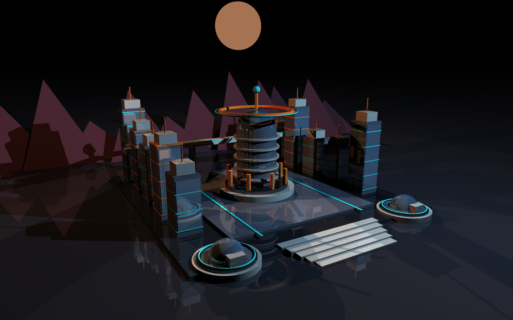
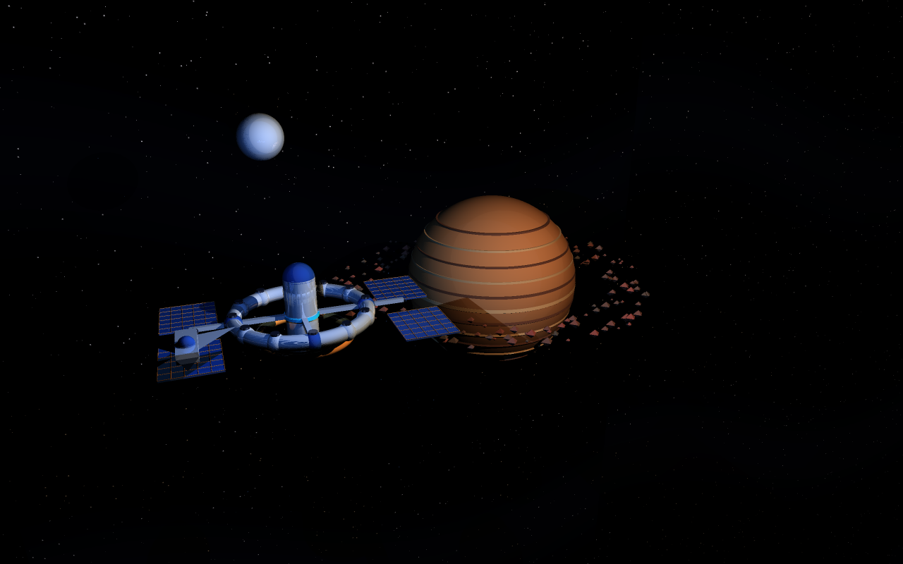
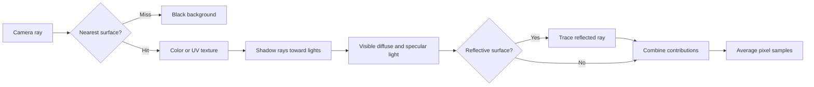

<div align="center">

# Ray Tracer

**From a university assignment to a C# renderer, one ray at a time.**

[](https://github.com/adamstirtan/raytracer/actions/workflows/build.yml)




*Future City — layered towers, a suspended reactor halo, and domed landing pads on a reflective plaza.*



*Orbital — a station beside a banded gas giant, a distant moon, and a belt of 180 faceted asteroids.*

Future City and Orbital are rendered at 1280 × 800 with four samples per pixel, cast shadows, and recursive reflections.


*Observatory — intersecting golden rings above a mirror lake, framed by mountain silhouettes and a blue planet. Rendered at 1280 × 900 with nine samples per pixel and reflection depth four.*

[How it works](#how-it-works) · [The rendering loop](#the-rendering-loop) · [Inside the project](#inside-the-project)

</div>

This project began as a university assignment and has grown through years of returning to the same question: **how do geometry and light become an image?** Today it is a CPU ray tracer written in C# on .NET 10, with imported meshes, textured materials, cast shadows, and recursive reflections.

## Light, surfaces, and a little recursion

<table>
<tr>
<td colspan="2"></td>
</tr>
<tr>
<td colspan="2"><strong>Imported geometry</strong><br />An OBJ skull, rendered by tracing rays through its triangles and shading the closest visible surface.</td>
</tr>
<tr>
<td width="50%"></td>
<td width="50%"></td>
</tr>
<tr>
<td><strong>Shadows & reflections</strong><br />Visibility rays determine which lights reach a surface. Reflected rays reveal the surrounding scene.</td>
<td><strong>Surface normals</strong><br />Each face's orientation controls how much light it receives. The same geometry appears in the reflective floor.</td>
</tr>
</table>

| Part of the renderer | What it contributes |
| :--- | :--- |
| **Geometry** | Spheres, planes, triangles, boxes, capped cylinders, disks, and ray-marched tori |
| **OBJ meshes** | Polygon triangulation and the nearest triangle intersection for each ray |
| **Materials** | Surface color, UV textures, diffuse lighting, specular highlights, and reflection strength |
| **Camera** | Perspective projection, look-at targets, and runtime position controls |
| **Sampling** | A regular subpixel grid—1, 4, 9, or more square-count samples—to smooth edges |
| **Execution** | Parallel image rows and immutable intersection results carrying each hit's normal |

## How it works

A ray starts at the camera and passes through a sample within a pixel. The renderer finds the nearest surface along that ray, calculates its lighting, and follows additional rays where needed.


```mermaid
flowchart LR
    A[Camera ray] --> B{Nearest surface?}
    B -->|Miss| C[Black background]
    B -->|Hit| D[Color or UV texture]
    D --> E[Shadow rays toward lights]
    E --> F[Visible diffuse and specular light]
    F --> G{Reflective surface?}
    G -->|Yes| H[Trace reflected ray]
    H --> I[Combine contributions]
    G -->|No| I
    I --> J[Average pixel samples]
```

Three ray types do the work:

- **Camera rays** answer “what surface is visible at this pixel?”
- **Shadow rays** answer “can this surface see the light?” A blocker counts only when it lies before the light.
- **Reflection rays** answer “what is visible in the mirror direction?” They repeat the same tracing process up to a depth limit.

## The rendering loop

The following pseudocode summarizes the renderer. Small offsets keep secondary rays from immediately intersecting the surface they just left.

```text
function render(scene, camera, samplesPerPixel, maxDepth):
    basis = lookAt(camera.position, camera.target)
    # If position equals target, use the +Z direction.

    parallel for each image row:
        for each pixel in row:
            colors = []

            for each sample in a regular grid within pixel:
                ray = perspectiveRay(camera.position, basis, sample)
                colors.append(trace(scene, ray, depth = 1, maxDepth))

            image[pixel] = clamp(average(colors), 0, 1)

    return image
```

The tracing function turns one intersection into a color:

```text
function trace(scene, ray, depth, maxDepth):
    if depth > maxDepth:
        return BLACK

    hit = nearestIntersection(scene, ray)
    if hit does not exist:
        return BLACK
    if hit.object is a light:
        return hit.object.color

    normal = hit.normal
    if ray started inside the sphere:
        normal = -normal            # Shade the interior-facing surface.

    baseColor = sampleTexture(hit.uv) if textured else hit.material.color
    color = BLACK

    for each light in scene:
        direction = normalize(light.position - hit.position)
        shadowRay = rayFrom(hit.position + direction * epsilon, direction)
        blocked = any non-light object intersects shadowRay before light

        if not blocked:
            color += diffuse(normal, direction, baseColor, light)
            color += specular(normal, direction, ray, light)

    if hit.material.reflection > 0 and depth < maxDepth:
        direction = reflect(ray.direction, normal)
        reflectedRay = rayFrom(hit.position + direction * epsilon, direction)
        color += hit.material.reflection * trace(scene, reflectedRay, depth + 1, maxDepth)

    return color
```

The closest-hit rule is essential for meshes: a triangle encountered first in the OBJ file may sit behind another triangle. Each ray searches the mesh for the smallest valid positive intersection distance and keeps that triangle's normal with the result.

## Inside the project

| Project | Responsibility |
| :--- | :--- |
| [RayTracer.Core](RayTracer.Core) | Geometry, materials, cameras, scenes, and the rendering engine |
| [RayTracer.Cli](RayTracer.Cli) | Scene selection, camera and sampling options, and PNG output |
| [RayTracer.Core.Tests](RayTracer.Core.Tests) | Regression tests for intersections, normals, shadows, camera targets, and small renders |
| [assets](assets) | OBJ models and example renders |

The showcases use the CLI's `future-city`, `orbital`, and `observatory` scenes, defined in [FutureCityScene.cs](RayTracer.Core/Scenes/FutureCityScene.cs), [OrbitalScene.cs](RayTracer.Core/Scenes/OrbitalScene.cs), and [ObservatoryScene.cs](RayTracer.Core/Scenes/ObservatoryScene.cs). The skull uses `mesh`. Other scenes include `sphere`, `triangle`, `box`, `cylinder`, `disk`, `billiards`, `hand`, `torus`, and `reflective`.

This is a classic direct-light ray tracer with recursive mirror reflections. Mesh intersections currently check every triangle; a spatial acceleration structure is a natural next step for larger models.
